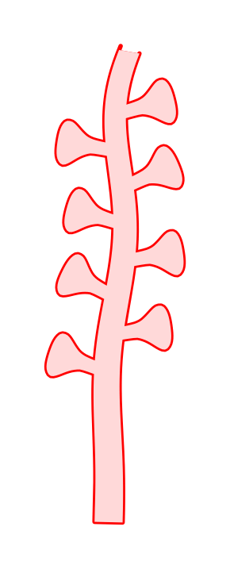
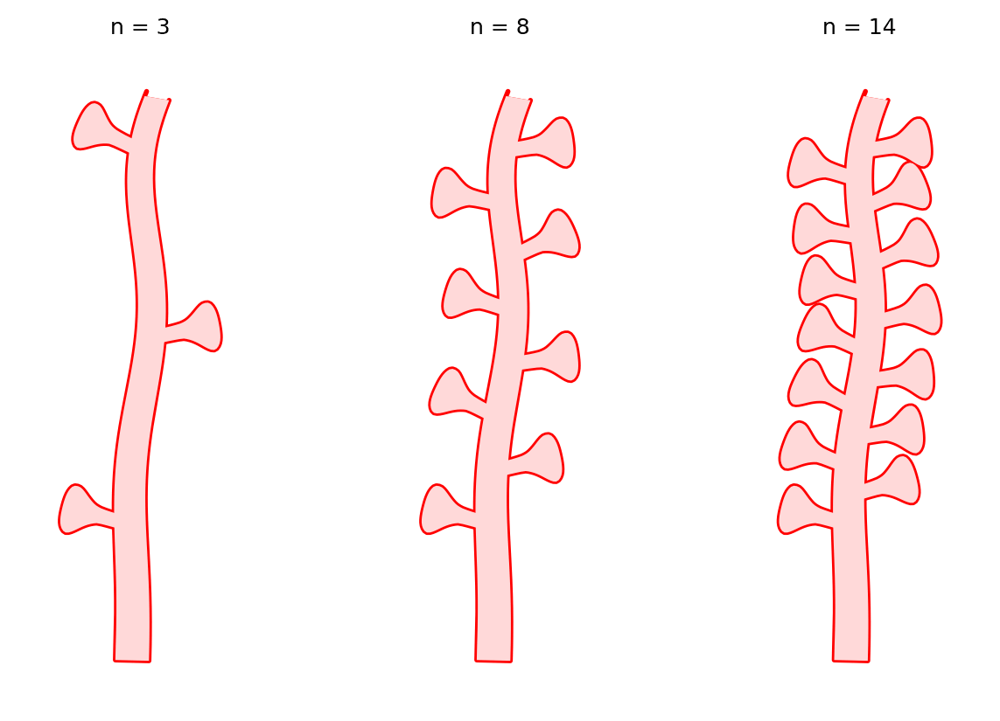
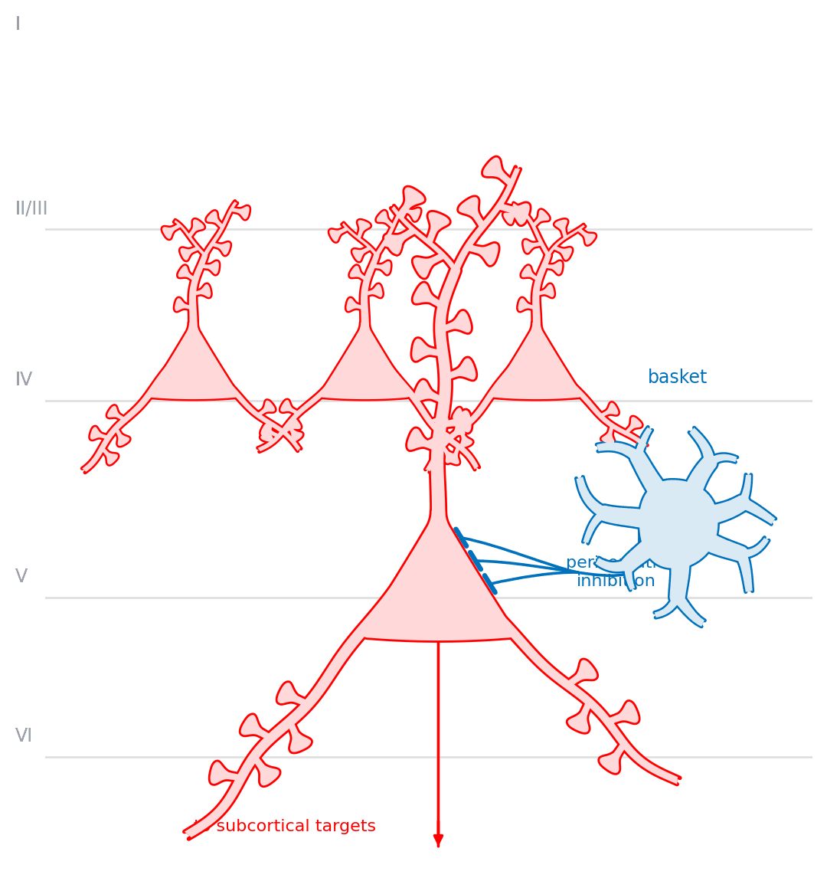

# biodraw

**Bio-inspired vector drawings for papers, posters and slides.**
Hand-drawn shapes, turned into maths, placeable anywhere.

<p align="center">
  
  
</p>

<p align="center">
  
</p>

You almost never want *the* picture — you want a variation on it. The same
cell at three spine densities, this epithelium curved into a duct, that neuron
with one more basal because the panel beside it has two. Here a variant is a
parameter and a rebuild is one command, and the drawing lands on a matplotlib
axes so it sits beside real data.

## → [Browse the gallery](https://deangeckt.github.io/biodraw/site/)

Every shape, every variant, and the code that draws each one. **That is the
documentation** — this file is only the front door.

## Install

```bash
pip install biodraw
```

```python
import biodraw as bd

cell = bd.neuro.Pyramidal(spines=8)
fig, ax = bd.canvas()
cell.draw(ax)
bd.save(fig, "cell.svg")                # vector, named layers, text as text
```

Most figures built with this will never be typed by hand. Install it, point an
agent at it, and describe what you want — three skills ship with the library
and are the supported way to drive it:
[`draw-a-figure`](skills/draw-a-figure/SKILL.md),
[`review-a-drawing`](skills/review-a-drawing/SKILL.md) and
[`trace-a-shape`](skills/trace-a-shape/SKILL.md), which turns a photograph of
your own drawing into a shape the library does not have yet.

## How it works, in one paragraph

Everything is a **hollow shape**: a wall around a washed interior. Overlapping
parts must read as *one unbroken contour* — no seam where a spine meets a
dendrite — and matplotlib has no boolean union, so `render_hollow` fakes one in
two passes: stroke-and-fill every part in the wall colour, then repaint the
union's interior on top, wiping exactly the strokes that fell inside a
neighbour. What survives is the outer rim. Almost every visual decision here
follows from that. None of the core is neuron-specific: a tapered, open-ended
tube is a dendrite, a hypha, a vessel or a root hair depending only on what is
drawn beside it — which is why `biodraw.neuro` is a *domain package*, not the
library.

## Around the repository

| | |
|---|---|
| [**Gallery**](https://deangeckt.github.io/biodraw/site/) | every example, and how to read it |
| [`examples/`](examples/) | the script that draws each one, plus its output |
| [`site/content/`](site/content/) | the prose behind each gallery page |
| [`skills/`](skills/README.md) | how an agent drives and extends this |
| [docs/PLAN.md](docs/PLAN.md) · [docs/STATE.md](docs/STATE.md) | where it is going · where it stands |
| [CONTRIBUTING.md](CONTRIBUTING.md) | new shapes, new domains, traced profiles |

## License

MIT — see [LICENSE](LICENSE). Use the figures anywhere. Citation appreciated,
not required: [CITATION.cff](CITATION.cff).
