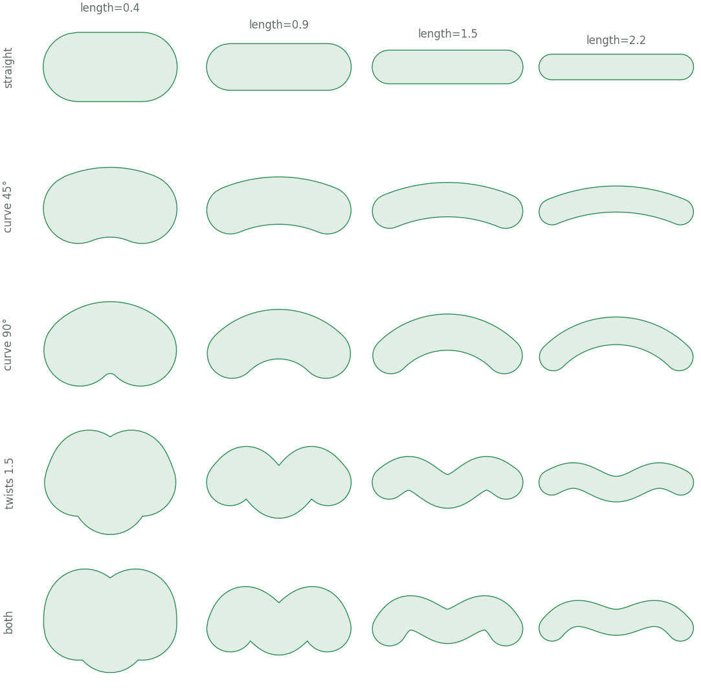
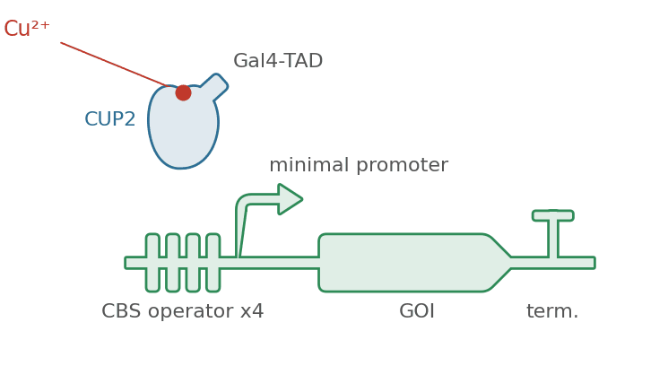
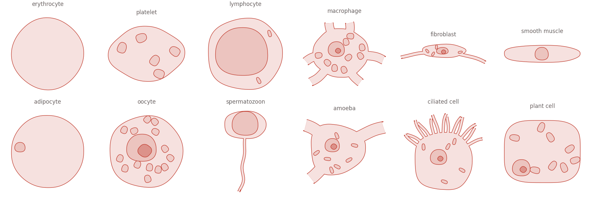

# biodraw

**Bio-inspired vector drawings for papers, posters and slides.**
A **Python** library: hand-drawn shapes, turned into maths, drawn onto a
matplotlib axes so they sit beside real data. Runtime dependencies are numpy
and matplotlib, and nothing else.

<p align="center">
  
  
  
</p>

<p align="center">
  
</p>

## → [Browse the catalog](https://deangeckt.github.io/biodraw/)

**15 examples, 79 figures** — neuroscience, cells & tissues, microbes,
genetics, animals and lab instruments. Every shape, every variant, and the
code that draws each one. **That is the documentation** — this file is only
the front door.

None of the core is tied to one field: a tapered, open-ended tube is a
dendrite, a hypha, a vessel or a root hair depending only on what is drawn
beside it, which is why `biodraw.neuro` is a *domain package* and not the
library.

## Install

```bash
pip install biodraw
```

```python
import biodraw as bd

cell = bd.neuro.Pyramidal(spines=8)
fig, ax = bd.canvas()
cell.draw(ax)
bd.save(fig, "cell.svg")                # vector, named layers, text as text
```

Most figures built with this are described rather than typed: install it,
point an agent at it, and the three skills under [`skills/`](skills/README.md)
are the supported way to drive it.

## Around the repository

| | |
|---|---|
| [**Catalog**](https://deangeckt.github.io/biodraw/) | every example, and how to read it |
| [`examples/`](examples/) | the script that draws each one, plus its output |
| [`site/content/`](site/content/) | the prose behind each catalog page |
| [`skills/`](skills/README.md) | how an agent drives and extends this |
| [docs/ROADMAP.md](docs/ROADMAP.md) · [docs/STATE.md](docs/STATE.md) | where it is going · where it stands |
| [CONTRIBUTING.md](CONTRIBUTING.md) | new shapes, new domains, traced profiles |

## License

MIT — see [LICENSE](LICENSE). Use the figures anywhere. Citation appreciated,
not required: [CITATION.cff](CITATION.cff).
