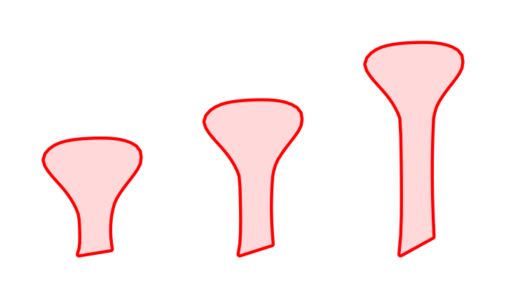
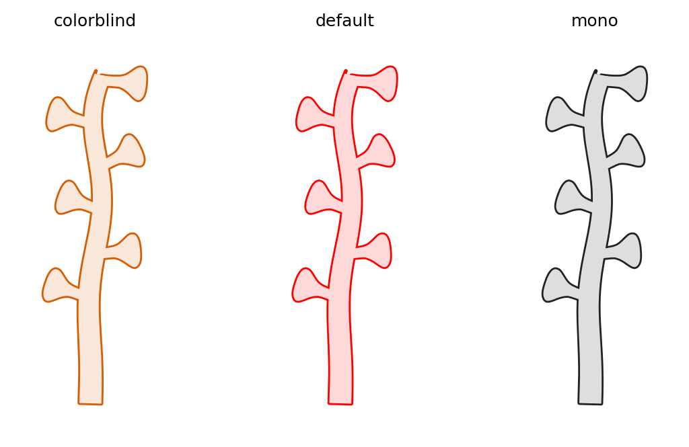
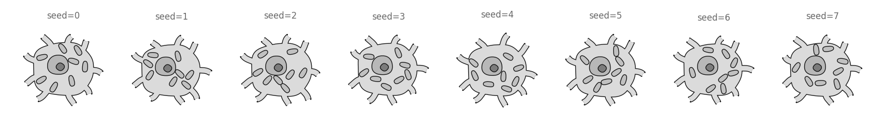
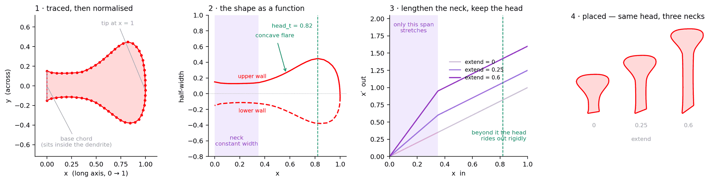

# biodraw

**Bio-inspired vector drawings for papers, posters and slides.**
Hand-drawn shapes, turned into maths, placeable anywhere.

<p align="center">
  
  
</p>

<p align="center">
  
  &nbsp;&nbsp;
  
</p>

```python
import biodraw as bd

cell = bd.neuro.Pyramidal(spines=8)
fig, ax = bd.canvas()
cell.draw(ax)
bd.save(fig, "cell.svg")                # vector, named layers, text as text
```

---

## Why not a stock illustration?

Because you almost never want *the* picture. You want a variation on it.

There are good free libraries of scientific art — NIAID's
[BioArt Source](https://bioart.niaid.nih.gov/) has 2,000+ vectors and icons
across viruses, anatomy, cells and organelles, bacteria, lab equipment. If you
need a virion or a centrifuge, take one from there. Nothing here competes with
that, and this library will never have a centrifuge in it.

What a stock asset cannot do is become the *next* one. A figure usually needs
the same cell at three spine densities to make its point, or this epithelium
but curved into a duct, or that neuron with one more basal because the one in
the panel beside it has two. With a fixed asset you either accept the picture
or open Illustrator and push points by hand — and the moment you do, the
figure has stopped being reproducible, and the reviewer's next question costs
the same work over again.

Here the drawing is a few parameters and a seed:

<p align="center">
  
</p>

<p align="center">
  
</p>

Every cell above is one line differing from its neighbour. That is the whole
proposition:

| | a stock asset | `biodraw` |
|---|---|---|
| need a variant | redraw it by hand | change a number |
| eight months later, a reviewer asks | redraw it by hand | `python build.py` |
| beside your own data | paste two files into a layout | it *is* a matplotlib axes |
| what the figure claims | whatever you drew | checkable, and pinned |
| a shape nobody has drawn yet | you are on your own | trace yours, and it joins the library |

The last row is the one that matters most. `Profile(..., normalize=True)`
takes an outline traced off your own drawing and puts it in the same canonical
frame as everything shipped here, so your shape stamps along a branch and
takes anchors exactly like the bundled one does. Your hand, this machinery.

And it composes: a `biodraw` shape draws onto an ordinary matplotlib axes, so
a figure can be half cartoon and half measurement without anything special.

## Every shape shows its maths

Shapes here are **traced from drawings and then derived** — not stacked
ellipses. Each one can draw the construction behind it, so you can see what
the geometry is doing and tune it on purpose:



A constant thin neck, then an accelerating concave flare into a blunt head.
That third panel is the knob that matters: `extend` stretches **only** the
neck, so a spine can stand further off its dendrite while its head stays
exactly the size it was — which is what stops heads touching on a densely
spined branch.

→ **[The full walkthrough](examples/dendritic_spine/)**

## Why it exists

These shapes started as drawings on paper. While making a figure for a paper,
I photographed my sketches and worked through them with an AI agent — and
found, in its scratch files, a matplotlib plot deriving the *shape of a
dendritic spine* as an actual curve. Not clip art. The real proportions of the
thing I had drawn, turned into maths I could place anywhere.

The figure got published. The code stayed locked inside a connectome analysis
repo, hard-wired to one figure in one paper. `biodraw` is that drawing kit,
taken out and made general — so nobody has to re-derive a spine.

> We already spent the tokens generating these images. Let's not spend them
> again.

## Two faces, on purpose

Scientific figures are increasingly *described*, not coded.

**Usage side — for people.** Short, readable, hard to get wrong. See the
snippet above.

**Implementation side — for agents.** An agent arrives cold, cannot see the
figure, and has to get it right without a human squinting at every pass:

| Agents need | `biodraw` gives |
|---|---|
| What a knob *does*, not just its type | Every parameter documents its effect and its failure mode — **now** |
| Not to draw nonsense quietly | Guards raise, with the three ways out named — **now** |
| To not re-derive shapes | `Profile(normalize=True)` — your drawing becomes a shape — **now** |
| A recipe for checking work it cannot see | [`skills/review-a-drawing`](skills/review-a-drawing/SKILL.md) — **now** |
| To know what exists, without grepping | `bd.catalog()` — every shape, knob and range as data — *planned* |
| To see the result without eyes | `bd.check(fig)` — overlaps, crossings, ink off-canvas — *planned* |
| To show its work | `bd.explain(shape)` — the blueprint above, generated — *planned* |

`AGENTS.md` ships in the repo, so a coding agent in *your* project picks up the
house style without being told.

## Your drawing, in the library

This is API, not backstory — your traced outline goes into the same canonical
frame as the bundled spine, and stamps along a branch exactly like it:

```python
prof = bd.Profile(
    points=traced,          # (N, 2) read off your drawing, any units
    normalize=True,         # → base chord at the origin, tip at x=1
    tip="wide",             # 'wide' for a spine or bouton; 'narrow' for a thorn
    stretch=(0.10, 0.38),   # the span that lengthens without inflating the head
    source="my whiteboard, 2026-08-16",       # provenance — it is a claim
)
bd.core.profile.register("bouton", prof)      # usable by name everywhere

branch.decorate("bouton", n=8, size=0.2)
```

There is deliberately **no image parser**. Building one would solve a problem
that no longer exists: you photograph the drawing, drop it into your agent's
chat, and talk about it — the agent already has eyes, and a bespoke UI would
be a worse version of the conversation you were going to have anyway. What is
needed is the *recipe*, and that ships as a skill:
**[`trace-a-shape`](skills/trace-a-shape/SKILL.md)**.

## Install

```bash
pip install -e ".[dev]"
```

## Examples

Every folder builds itself — `python tools/build_gallery.py <name>` — and
every image on this page came out of one.

| | |
|---|---|
| [**circuit_motifs**](examples/circuit_motifs/) | six wiring motifs and a cortical column |
| [**axon_and_wiring**](examples/axon_and_wiring/) | boutons, collaterals, connectors, endcaps, contact placement |
| [**pyramidal_cell**](examples/pyramidal_cell/) | soma, apical, basals — one unbroken outline |
| [**basket_cell**](examples/basket_cell/) | the inhibitory counterpart, told apart structurally |
| [**dendritic_spine**](examples/dendritic_spine/) | the traced profile everything else is stamped from |
| [**generic_cell**](examples/generic_cell/) | nucleus, organelles, protrusions — the first shape that is not one contour |
| [**epithelial_sheet**](examples/epithelial_sheet/) | a row of cells, curvable into a duct |

<p align="center">
  
</p>

## Status

Early, but the engine is built and pinned, and both domains are drawing.

| | |
|---|---|
| Profiles, branches, tubes, bodies, hollow rendering, layers, scatter | **done** |
| Palettes, canvas, SVG export with named layers, byte-reproducible | **done** |
| Anchors, contact placement, connectors with endcaps | **done** |
| `neuro`: Pyramidal, Basket, Axon | **done** |
| `cells`: Blob, Sheet | **done** |
| Skills: `draw-a-figure`, `review-a-drawing`, `trace-a-shape` | **done** |
| Layout, legends, style presets, panel letters | next |
| `explain()`, `catalog()`, `check()` | planned |

→ **[Roadmap](docs/PLAN.md)** · **[Skills](skills/README.md)** · **[Where things stand](docs/STATE.md)**

## How it works, in one paragraph

Everything is a **hollow shape**: a wall around a washed interior. Overlapping
parts must read as *one unbroken contour* — no seam where a spine meets a
dendrite — and matplotlib has no boolean union, so `render_hollow` fakes one in
two passes: stroke-and-fill every part in the wall colour, then repaint the
union's interior on top, wiping exactly the strokes that fell inside a
neighbour. What survives is the outer rim. Almost every visual decision here
follows from that. None of the core is neuron-specific: a tapered, open-ended
tube is a dendrite, a hypha, a vessel or a root hair depending only on what is
drawn beside it — which is why `biodraw.neuro` is a *domain package*, not the
library.

## Contributing

New shapes, new domains, and traced profiles from your own drawings are all
welcome — see [CONTRIBUTING.md](CONTRIBUTING.md).

## License

MIT — see [LICENSE](LICENSE). Use the figures anywhere. Citation appreciated,
not required: [CITATION.cff](CITATION.cff).
