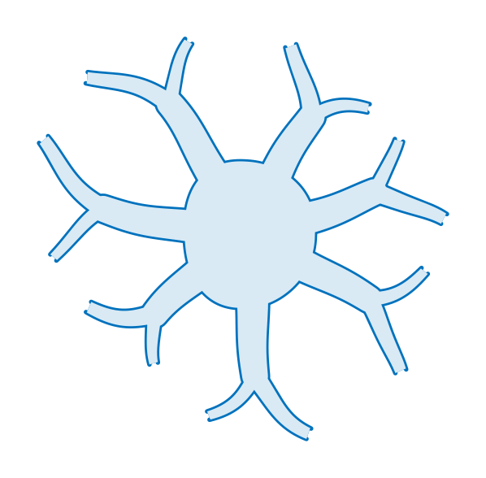
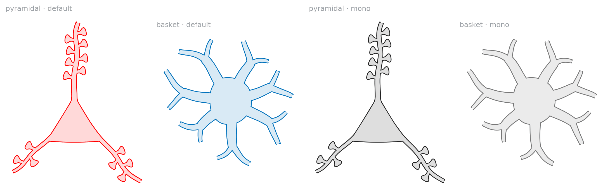
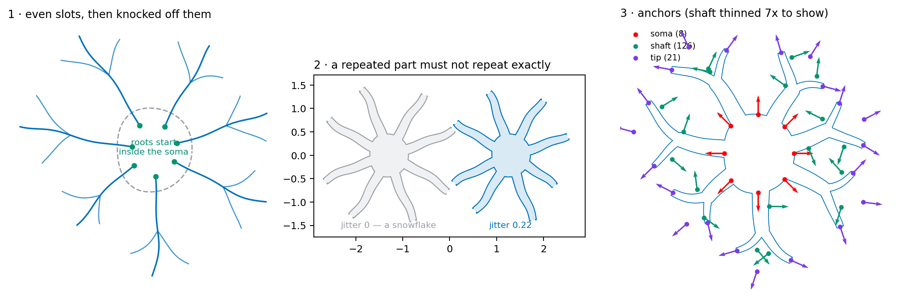
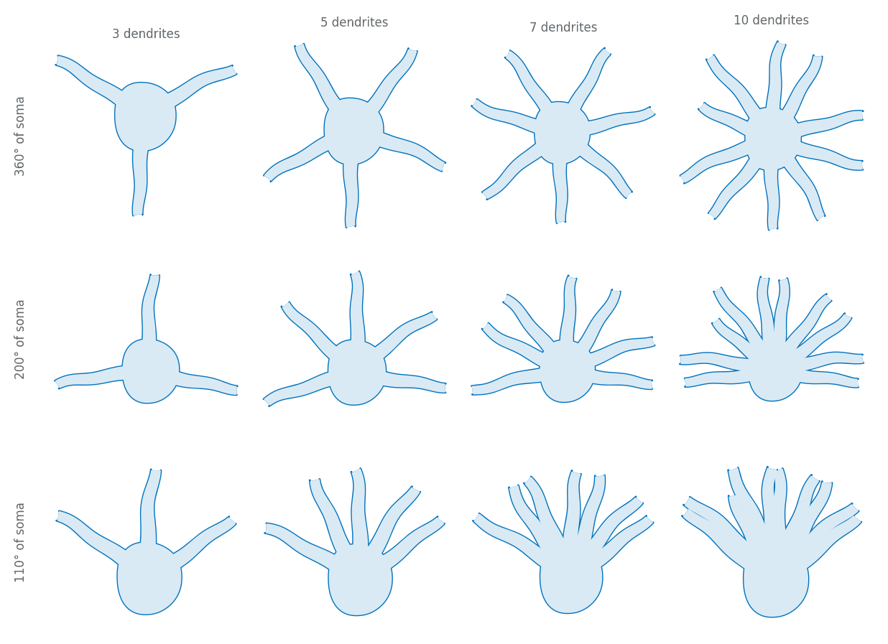
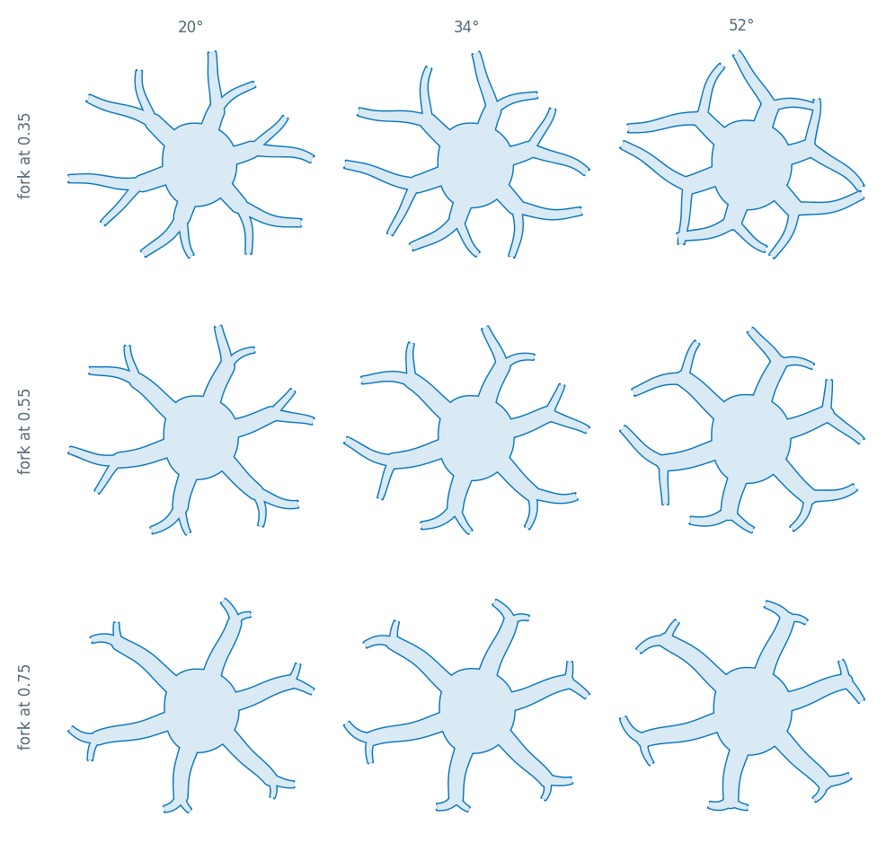
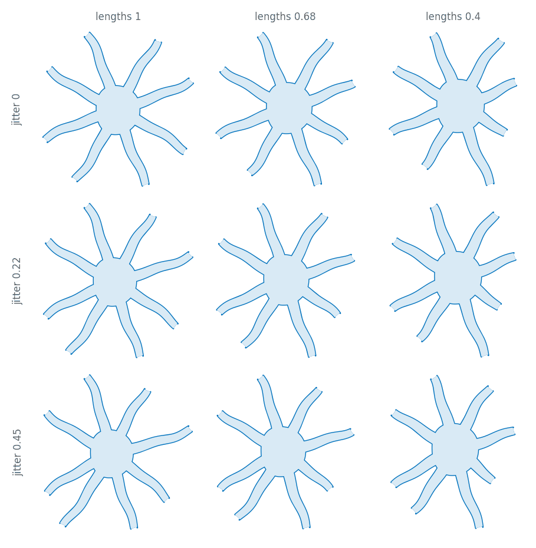
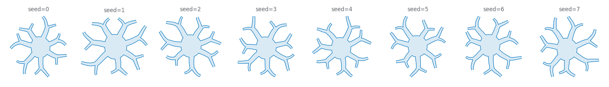

# Basket cell

A round soma with smooth dendrites leaving in every direction — the
counterpart to the [pyramidal cell](../pyramidal_cell/), and drawn to be told
apart from it at a glance.

<p align="center">
  
</p>

## Told apart without colour



Three cues do the work, and **all three are structural**:

- a **round** soma instead of a triangle;
- dendrites in every direction, rather than one up and two down;
- **smooth** dendrites — a basket cell is aspiny, and drawing it that way is
  what a reader sees first.

That matters because a hue difference does not survive greyscale printing, and
the whole job of an inhibitory cell in a circuit panel is to be obviously not
the excitatory one. The right-hand pair above is the `mono` palette.

## The blueprint



**1 · Even slots, then knocked off them.** Dendrites are placed on an even
sweep round the soma and then displaced, by at most half a step so the order
round the soma survives. Each is rooted *inside* the wall, so its flat base is
swallowed by the soma's fill and the two fuse rather than butt.

**2 · A repeated part must not repeat exactly.** At `jitter=0` with equal
lengths the cell is a snowflake — the eye reads regularity as a diagram. See
[docs/PLAN.md](../../docs/PLAN.md) for the rule and where else it applies.

**3 · Anchors.** Round the soma, along every dendrite shaft, and at every tip.

## Drawing one

```python
import biodraw as bd

cell = bd.neuro.Basket(
    dendrites=7,            # how many leave the soma
    forks=0.55,             # fraction along each at which it splits, None for straight
    length_ratio=0.68,      # shortest dendrite as a fraction of the longest
    jitter=0.22,            # how far each wanders off its even slot
    seed=2,                 # fixes both — same seed, same cell, forever
)

fig, ax = bd.canvas(figsize=(3.6, 3.6))
cell.draw(ax=ax, wall_lw=1.0, gid="basket")
cell.fit(ax, pad=0.14)
bd.save(fig, "basket.svg")
```

## Body plans

How many dendrites, and over how much of the soma they leave.



```python
cell = bd.neuro.Basket(
    dendrites=5,
    arc_deg=200,            # 360 is multipolar; narrower gives a bitufted look
    start_deg=-10,          # where the sweep begins, counter-clockwise from +x
)
```

A narrower arc gives a bitufted or bipolar-looking cell without needing
another class.

## Branching



```python
cell = bd.neuro.Basket(
    dendrites=6,
    forks=0.55,             # where along the dendrite it splits
    fork_angle_deg=34,      # the total crotch angle
    fork_ratio=0.76,        # the lesser daughter, as a fraction of the greater
)
```

The daughters are sized by Rall — their cross-sections sum to the parent's —
so both come out thinner than what they leave. That is not decoration: a
daughter as wide as its parent cannot have its base buried at *any* depth, and
the joint shows a spur. See `paths.buried_base`.

## Regularity



Top-left is the failure case: identical dendrites at identical spacing.

```python
cell = bd.neuro.Basket(
    dendrites=8,
    jitter=0.22,            # 0 puts them on exact centres
    length_ratio=0.68,      # 1.0 makes them all the same length
)
```

## Seeds



```python
row = [bd.neuro.Basket(dendrites=7, forks=0.55, seed=s) for s in range(8)]
```

## Anchors

| kind | where | count on the cell above |
|---|---|---|
| `soma` | eight points round the wall | 8 |
| `shaft` | both walls of every branch, at three points along it | 126 |
| `tip` | the end of each branch | 21 |

```python
top   = cell.anchor("soma", deg=90.0)
tip   = cell.anchor("tip", branch="dend0")
near  = cell.anchors("soma").nearest(point=(-6.0, 0.0))   # the side it faces
```

See [`axon_and_wiring`](../axon_and_wiring/) for what to do with them.

## Files

| | |
|---|---|
| `build.py` | builds every image here — `python tools/build_gallery.py basket` |
| `blueprint.png` | the construction figure |
