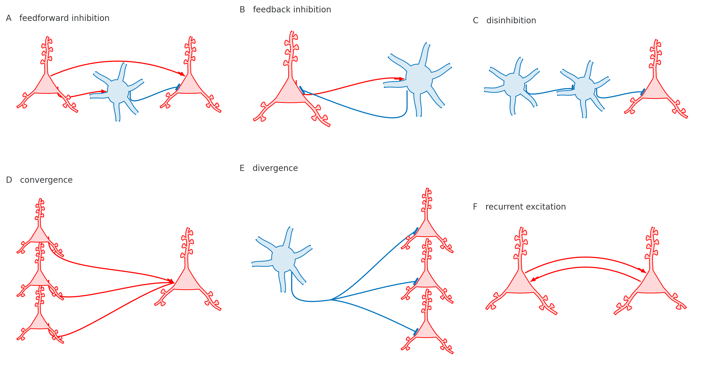
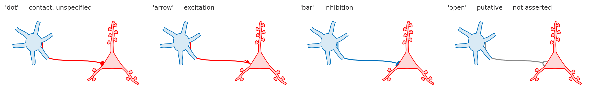
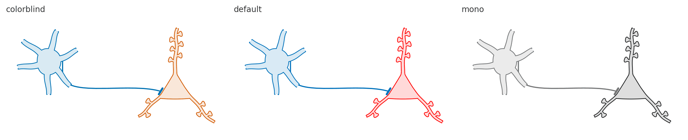

# Circuit motifs

Cells wired to each other — which is what everything else in this library was
building toward.

<p align="center">
  
</p>

A cortical column: layer II/III pyramidal cells with forked apicals, one large
layer V cell, a basket cell making perisomatic contacts on it, and the layer V
output leaving as an axon with boutons. The layer rules are the only
horizontal lines in the figure — **nothing else sits on a baseline by
accident.**

## Six motifs



One colour and one mark per claim, held across all six panels, so the key is
three lines rather than a paragraph:

| | |
|---|---|
| red, arrowhead | excitation |
| blue, bar | inhibition |

```python
import biodraw as bd

pyr = bd.neuro.Pyramidal(spines=6, basal=2, at=(-1.9, 0.0), scale=0.55)
bas = bd.neuro.Basket(dendrites=6, forks=None, at=(0.0, -0.3), scale=0.85)
for cell in (pyr, bas):
    cell.draw(ax=ax, wall_lw=0.9)

bd.connect(
    ax=ax,
    source=pyr.anchor("soma", nearest=bas.at),   # the flank facing the target
    target=bas.anchor("soma", nearest=pyr.at),
    gap=0.05,               # clearance at the wall, in local units
    drop=0.15,              # drop clear of the cell before running
    rad=0.07,               # bow; positive always bows up
    endcap="arrow",         # the claim: excitation
)
```

`nearest` is what makes this readable: each connector lands on the side of the
cell it is arriving from rather than reaching around the back, without any
per-panel tuning.

Panel **E** uses `bd.connect_tree` rather than three separate calls — a cell
reaching three targets has one axon that branches, not three axons. See
[`axon_and_wiring`](../axon_and_wiring/README.md#one-source-several-targets)
for the side-by-side.

## The same pair, four claims



Identical cells, identical geometry. Only the endcap and the colour change,
which is exactly how much should have to.

```python
bd.connect(ax=ax, source=src, target=dst, endcap="bar", color=INH)
```

`'open'` is the one worth knowing about: a contact of the same kind that the
figure is **not** asserting. If the data do not support the claim, the drawing
should not make it.

## Three palettes



```python
p = bd.style.palette.get("colorblind")     # or 'default', or 'mono'
pyr.draw(ax=ax, edge=p["excitatory"])
bas.draw(ax=ax, edge=p["inhibitory"])
```

- **`default`** — the palette the reference figure was drawn in.
- **`colorblind`** — Okabe-Ito, distinguishable under all common forms of
  colour blindness. Use this for print.
- **`mono`** — no hue at all, for journals that charge for colour, and as the
  check that a drawing still reads when its colours are taken away. If a
  figure only works in the first palette, it is relying on colour to carry a
  claim, and it will fail on someone's greyscale printout.

That check is why the two cell types differ **structurally** — a triangle with
one apical, versus a round soma with dendrites in every direction — rather
than only by hue. See [`basket_cell`](../basket_cell/README.md#told-apart-without-colour).

## Building the column

```python
big = bd.neuro.Pyramidal(
    spines=10, basal_spines=5,
    trunk_len=2.9,          # apical reaching layer I
    apical_fork=0.68,       # ...forking near the top, as a real one does
    at=(0.1, -1.15), scale=1.05, seed=7,
)

bd.connect_tree(
    ax=ax,
    source=bas.anchor("soma", nearest=big.at),
    # Perisomatic — what a basket cell does. Named outright, because which
    # compartment a contact lands on is a claim, and the author makes it.
    targets=[big.anchor("soma", side=1, t=t) for t in (0.24, 0.42, 0.60)],
    gap=0.035, drop=0.28, fork=0.5, spread=0.42,
    endcap="bar", color=INH,
)
```

Every cell takes a `seed`, and cells that would otherwise be identical get
different ones — three layer II/III cells drawn from one seed are three copies
of one cell, which reads as a diagram rather than as tissue.

## Files

| | |
|---|---|
| `build.py` | builds every image here — `python tools/build_gallery.py motifs` |
| `column.png` | the flagship composition |
