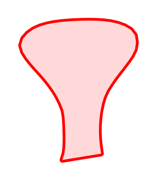

# Dendritic spine

The shape `biodraw` grew out of, and the clearest example of why it traces
rather than synthesises.

<p align="center">
  
</p>

## The blueprint

Every attempt to build this profile out of ellipses and smoothsteps read as a
cone, a bead on a stick, or a leaf. What makes it a spine is a **constant thin
neck** for the first third, then an **accelerating concave flare** into a
blunt, slightly up-tilted head. Easier to draw by hand and trace than to
guess — and once traced, it becomes maths you can place anywhere.


**1 · Traced, then normalised.** 56 vertices from a hand drawing, rotated onto
their long axis and scaled so the shape spans `x = 0 → 1`. The base chord sits
at the origin; when placed, it is sunk inside the dendrite wall so no stub
shows.

**2 · The shape as a function.** The two walls plotted as half-width against
`x`. The flat stretch on the left is the neck; the acceleration after it is
the flare. The gentle upper/lower asymmetry is the original drawing's wobble,
kept on purpose — it is what stops a branch of these reading as stamped clip
art.

**3 · Lengthening the neck.** Scaling a spine up inflates its head, and on a
densely spined dendrite the heads start touching. So `extend` stretches *only*
the shaded span, and everything past it — the flare and the head, the whole
recognisable part — rides out rigidly. The plot is that piecewise map.

**4 · Placed.** Same head, three neck lengths.

Drawing one:

```python
import biodraw as bd
from biodraw.core import profile, render

spine = profile.get("spine")
outline = spine.place(
    base=(0, 0),            # where it roots, on the host's centreline
    direction=(0, 1),       # which way it points
    size=1.0,               # length of the whole profile, in local units
)

fig, ax = bd.canvas(figsize=(1.8, 2.4))
render.render_hollow(
    ax=ax,
    parts=[outline],
    fill="#FFD9D9",         # the interior wash
    edge="#FF0000",         # the wall
    wall_lw=2.0,            # wall thickness, in points
    gid="spine",            # names the layer in the exported SVG
)
bd.fit(ax, [outline], pad=0.08)
bd.save(fig, "spine.svg")
```

## Turning the knobs

`extend` changes how far a spine stands off its branch, without resizing it:

<p align="center"></p>

```python
outlines = [
    spine.place(base=(i * 0.42, 0), direction=(0, 1), size=0.3, extend=e)
    for i, e in enumerate((0.0, 0.10, 0.25))
]
```

## On a branch

A `Branch` stamps the profile along a curved centreline, alternating sides,
and the tube plus every spine fuse into **one unbroken outline** — no seam
where a spine meets the dendrite.

<p align="center">
  
  
</p>

```python
from biodraw.core.branch import Branch

branch = Branch(
    origin=(0, 0),
    direction=(0, 1),
    length=1.8,
    bend=0.10,              # the slow lean; sign picks the side
)
branch.decorate(
    profile="spine",
    n=8,                    # how many
    size=0.21,              # each spine's length
    extend=0.04,            # ...plus this much extra neck
    first_t=0.30,           # leave the proximal shaft bare
    last_t=0.86,            # ...and stop short of the tip
)

dendrite_wall, open_tip = branch.parts(
    width=0.11,             # full tube width where it leaves the origin
    taper=0.72,             # width at the tip, as a multiple of that
    base_ext=0.05,          # bury the base inside whatever it grows from
)

fig, ax = bd.canvas(figsize=(2.8, 4.4))
render.render_hollow(
    ax=ax,
    parts=dendrite_wall,    # closed outlines — the spines
    open_parts=open_tip,    # the tube, whose far end stops rather than caps
    fill="#FFD9D9",
    edge="#FF0000",
    wall_lw=1.0,
    gid="dendrite",
)
bd.fit(ax, dendrite_wall + open_tip, pad=0.12)
```

`first_t` leaves the proximal shaft bare on purpose: that is where anything
contacting the *shaft* has to land, and a shaft contact arriving next to a
spine head reads as a spine contact — the wrong claim entirely.

## Colour

<p align="center"></p>

```python
palette = bd.style.palette.get("colorblind")
edge = palette["excitatory"]
```

## Files

| | |
|---|---|
| `build.py` | builds every image here — `python tools/build_gallery.py spine` |
| `blueprint.png` | the construction figure, drawn from the same `Profile` object |
| `spine.svg` | the deliverable: vector, named layers, ready for a paper |

The blueprint is hand-written here. It is the prototype for `bd.explain()`,
which will generate one for every shape in the library.
