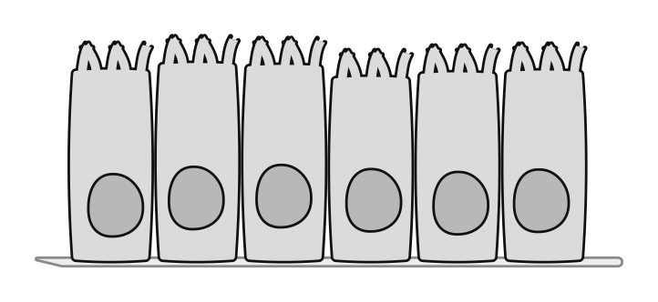
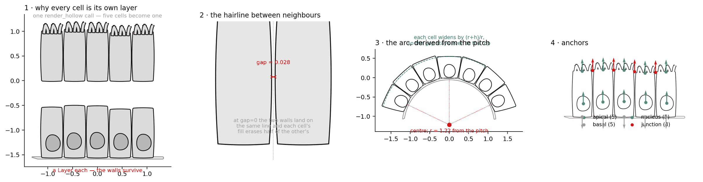
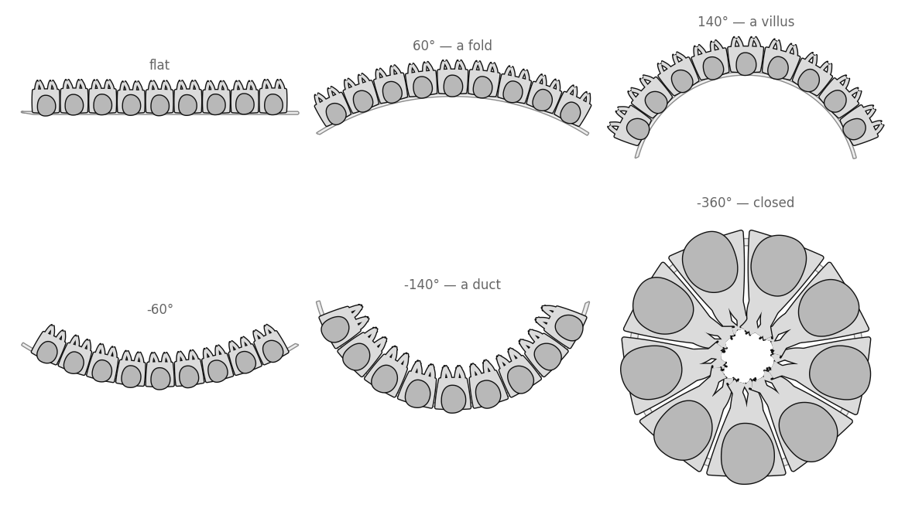
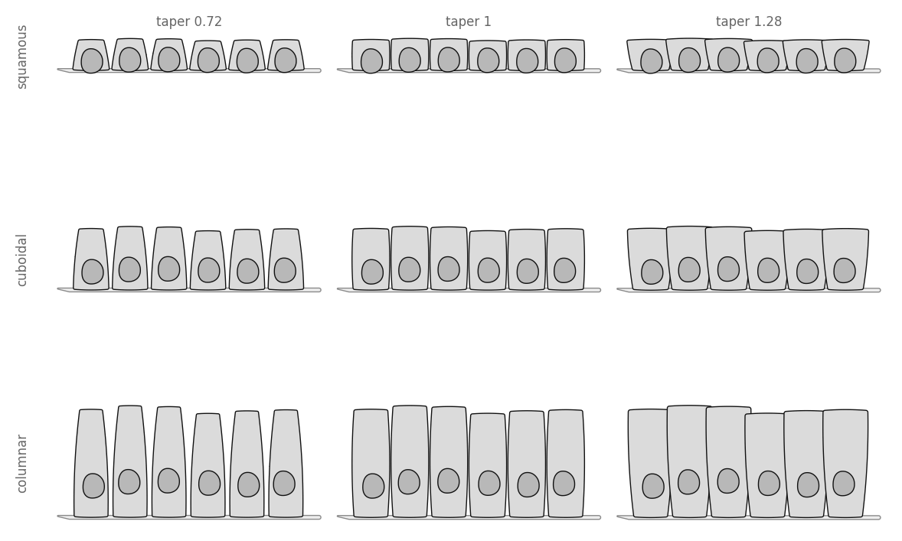
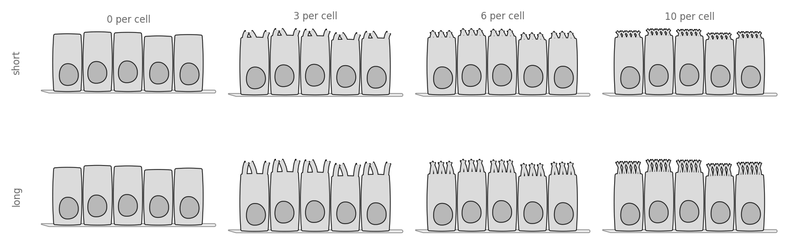

# Epithelial sheet

A row of cells standing on a basement membrane. Where the [generic
cell](../generic_cell/) is one cell that is not one contour, this is many
cells that must **not become one**.

<p align="center">
  
</p>

## The blueprint



**1 · Why every cell is its own layer.** The top row is five cells handed to a
single `render_hollow` call: the union does exactly what it was asked and
dissolves every shared wall, leaving one long cell. The bottom row is the same
five outlines with a `Layer` each. Nothing about the geometry changed — only
how many times it was drawn.

**2 · The hairline between neighbours.** `gap` is real page between two cells,
and it cannot be zero for free: at zero the two walls land on the same line and
each cell's second pass erases half of the other's, leaving a join at half
weight. A visible boundary is also the more honest drawing — an epithelium is
drawn with its boundaries showing, because the boundary is the point.

A bug this panel caught: the lateral walls bow outward by `bow_side` × their
own length, which at the defaults is 0.018 a side against a gap of 0.0276, so
neighbours overlapped by 0.008. The quad is now set in by the bulge, and `gap`
means what it says.

**3 · The arc, derived from the pitch.** `curve_deg` bends the row. The radius
is not a knob — it follows from one cell's width subtending one pitch angle,
which is what makes `curve_deg=-360` close *exactly* at any cell count instead
of leaving a wedge to tune away. Each cell then widens by `(r+h)/r` toward its
apical surface, because on an arc the outer surface is longer; without that,
a wedge opens between every pair and the tissue reads as tearing.

**4 · Anchors.** Apical and basal surface per cell, one nucleus, and one
junction per boundary — placed at the apical end of the shared wall, which is
where a tight junction is and so where a label about one points.

## Drawing one

```python
import biodraw as bd

sheet = bd.cells.Sheet(
    cells=6,                # how many, side by side
    cell_w=0.46,            # the pitch, at the basal line
    height=1.0,             # basal surface to apical surface
    gap=0.06,               # page left between neighbours, x cell_w
    nucleus=0.30,           # nuclear semi-axis, x cell_w
    nucleus_at=0.32,        # basal — the cheapest cue that the sheet has a polarity
    microvilli=5,           # brush border, per cell
    basement=True,          # the band the sheet stands on
    seed=1,                 # fixes the nucleus and height jitter
)

fig, ax = bd.canvas(figsize=(4.4, 2.6))
sheet.draw(
    ax=ax,
    wall_lw=1.0,            # wall thickness, in points
    gid="epithelium",       # names the layers in the exported SVG
)
sheet.fit(ax, pad=0.10)
bd.save(fig, "epithelium.svg")
```

## Curvature

The one knob that turns a sheet into a fold, a villus, a duct, or a closed
ring of cells around a lumen.



```python
sheet = bd.cells.Sheet(
    cells=9,
    curve_deg=-360,         # negative curls the apical surface inward
    height=0.36,            # must stay inside the arc radius — see below
    microvilli=4,
)
```

Positive puts the apical surface on the outside; negative encloses a lumen.
At `-360` the ring closes on itself exactly.

Bend too far for the height and `Sheet` **refuses**, naming the three ways
out, rather than drawing a row turned inside out:

```
ValueError: curve_deg=-360 bends the row tighter than height=0.62 allows —
the apical surface passes through the centre of the arc. Reduce the height,
widen the cells, or bend less far.
```

## Cell shapes

Squamous, cuboidal, columnar — one object at three heights, crossed with what
the taper does to each.



```python
sheet = bd.cells.Sheet(
    cells=6,
    height=0.34,            # 0.34 squamous · 0.70 cuboidal · 1.25 columnar
    taper=0.72,             # apical pitch as a multiple of basal
    nucleus=0.26,
)
```

## Brush border



```python
sheet = bd.cells.Sheet(
    cells=5,
    microvilli=6,               # per cell
    microvilli_len=0.40,        # x cell_w
    microvilli_width=0.09,      # x cell_w
)
```

Each villus belongs to its own cell's layer, so it fuses with that cell and
with nothing else — including the neighbour a millimetre away. They are aimed
along their own cell's axis rather than along the local radius: on a curved
sheet the two differ, and following the radius fans them apart at the ends of
a cell, which reads as fraying rather than as a border.

## No two cells alike

The nuclei wander, and so does each cell's own apical height. A row of
identical cells is a row of copies, and a perfectly level apical surface is
the first thing the eye finds in the drawing.

```python
sheet = bd.cells.Sheet(
    cells=6,
    nucleus_jitter=0.05,    # x the cell height
    height_jitter=0.04,     # x the cell height
    seed=1,                 # ...and both are seeded, so it still redraws byte-identically
)
```

## Anchors

| kind | where | count on a 6-cell row |
|---|---|---|
| `apical` | the middle of each apical surface, pointing out | 6 |
| `basal` | the middle of each basal surface, pointing down | 6 |
| `nucleus` | one per nucleus | 6 |
| `junction` | the apical end of each shared wall | 5 |

```python
lumen_side = sheet.anchor("apical", cell=2)         # third cell, apical face
tight      = sheet.anchor("junction", rank=0)       # the first boundary
under      = sheet.anchor("basal", cell=0)          # where the membrane is
```

A closed ring has one junction *per cell* rather than one fewer, because the
last cell has a neighbour on both sides.

## Files

| | |
|---|---|
| `build.py` | builds every image here — `python tools/build_gallery.py epithelial` |
| `blueprint.png` | the construction figure |
