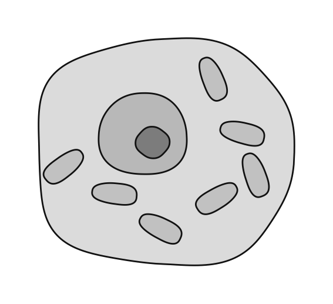
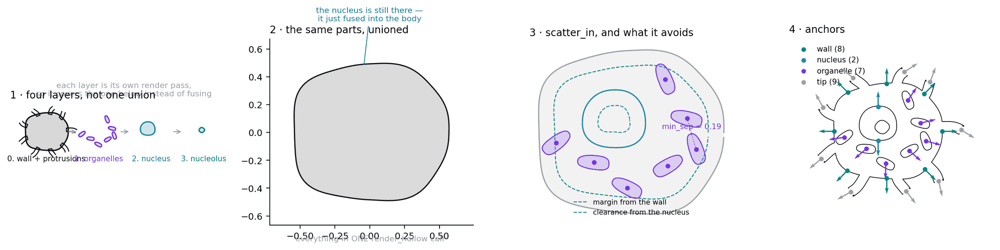
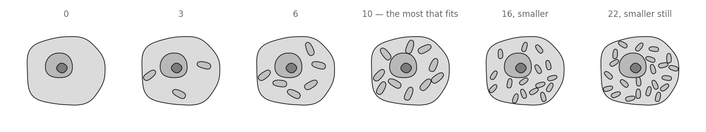
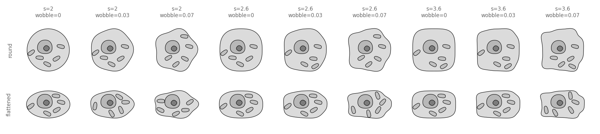
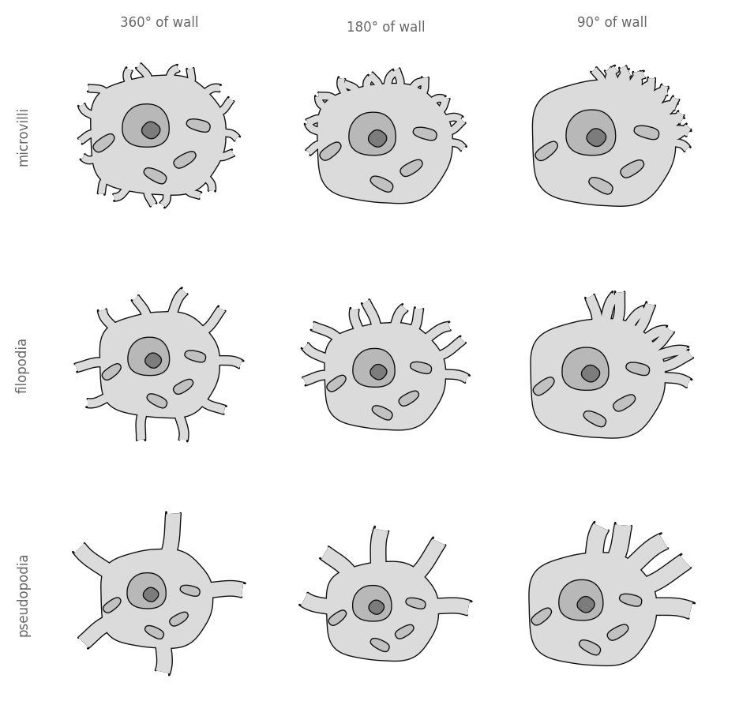

# Generic cell

A body, a nucleus, and whatever is loose in the cytoplasm. The first shape in
this library that is **not one unbroken outline** — and the reason
`biodraw.core.shape.Layer` exists.

<p align="center">
  
</p>

## The blueprint



**1 · Four layers, not one union.** Every shape before this one drew in a
single `render_hollow` call, because a pyramidal cell really is one contour —
soma, dendrites and spines all fusing. A cell with a nucleus cannot be. Each
layer is its own render pass at its own zorder, so it *covers* the one beneath
instead of joining it. The wall and its protrusions still share a layer,
because those two should fuse.

**2 · The same parts, unioned.** What happens without layers, drawn from the
identical outlines: the nucleus, the nucleolus and all seven organelles are
still there. They have simply become part of the body's fill. There is no
boolean difference in matplotlib, so "inside and still visible" can only be
said by drawing again, higher up.

**3 · `scatter_in`, and what it avoids.** Nothing here grows along a path, so
the branch engine has nothing to offer. The organelles are rejection-sampled
inside the wall, with a margin off the membrane, a clearance from the nucleus,
and a minimum separation from each other. Ask for more than fits and it
**raises** — silently drawing four when nine were asked for would make the
picture a claim the code never made.

**4 · Anchors.** Round the wall, on the nuclear envelope, one per organelle
and one per protrusion tip. Same anchors as any other shape, so connectors and
labels work here for free.

## Drawing one

```python
import biodraw as bd

cell = bd.cells.Blob(
    radius=0.55,            # the one size knob; everything else is a fraction of it
    squareness=2.6,         # 2 is an ellipse, 4 a rounded box
    wobble=0.028,           # swells the wall, so it does not read as an equation
    nucleus=0.34,           # nuclear radius, x the body radius
    nucleolus=0.36,         # ...and the nucleolus, x the nuclear radius
    organelles=7,           # scattered in the cytoplasm
    seed=3,                 # fixes the scatter — same seed, same cell, forever
)

fig, ax = bd.canvas(figsize=(3.4, 3.2))
cell.draw(
    ax=ax,
    wall_lw=1.0,            # wall thickness, in points
    gid="cell",             # names the layers in the exported SVG
)
cell.fit(ax, pad=0.12)
bd.save(fig, "cell.svg")
```

The exported SVG carries one named group per layer — `cell.nucleus.wall`,
`cell.organelles.fill` — so "select all the organelles" is one click in
Illustrator rather than a hunt through anonymous paths.

## How much is in it



```python
cell = bd.cells.Blob(
    organelles=10,          # the most that fits at the default size
    organelle_size=0.17,    # long semi-axis, x the body radius
    organelle_sep=0.34,     # closest two may sit, x the body radius
)
```

Past ten, `scatter_in` raises rather than drawing fewer. Getting more in means
smaller organelles packed closer — which is a statement about the cell, not a
rendering detail, so you have to say it:

```python
cell = bd.cells.Blob(
    organelles=22,
    organelle_size=0.115,   # smaller...
    organelle_sep=0.22,     # ...and closer
)
```

## Body plans



```python
cell = bd.cells.Blob(
    squareness=2.6,         # 2.0 ellipse · 2.6 settled cell · 3.6 rounded box
    wobble=0.03,            # 0 is visibly an equation; past 0.08 reads as damage
    wobble_n=5,             # how many swells go round
    aspect=0.62,            # semi-axis along y, x radius — below 1 it lies down
)
```

## Membranes

The same `Branch` engine that draws a dendrite, doing microvilli, filopodia
and pseudopodia — which is the domain-neutrality claim being cashed rather
than asserted.



```python
cell = bd.cells.Blob(
    protrusions=10,             # short tubes out of the wall
    protrusion_len=0.34,        # x the body radius
    protrusion_width=0.07,      # x the body radius
    protrusion_arc_deg=180,     # sweep of wall they cover — 360 goes all round
    protrusion_start_deg=0,     # counter-clockwise from +x
)
```

They are rooted *inside* the wall so their flat base is swallowed by the
body's fill, and they share the body's layer so the two fuse. That is the same
trick a basal dendrite uses on a soma corner.

## Seeds


Nothing differs between these but `seed`. It fixes the organelle scatter,
their angles, and how far each protrusion is knocked off its even slot —
because **a repeated part must not repeat exactly**. At
`protrusion_jitter=0` the protrusions sit on perfect 40° centres and the cell
reads as a gear.

```python
row = [bd.cells.Blob(organelles=8, protrusions=9, seed=s) for s in range(8)]
```

Same seed, same bytes: CI enforces it on this folder.

## Anchors

| kind | where | count on the cell above |
|---|---|---|
| `wall` | eight points round the membrane, on the axes and the diagonals | 8 |
| `nucleus` | top and bottom of the nuclear envelope | 2 |
| `organelle` | one per organelle, pointing away from the cell's centre | 7 |
| `tip` | the end of each protrusion | 9 |

```python
top    = cell.anchor("wall", deg=90.0)          # the top of the membrane
nuc    = cell.anchor("nucleus", deg=90.0)       # the nuclear envelope
third  = cell.anchor("organelle", rank=2)       # the third organelle placed
label_at = top.offset(0.08)                     # 0.08 clear of the wall
```

`wall` anchors sit on the **wobbled** outline, not the ideal superellipse —
`superellipse_radius` gives the un-wobbled wall, and an anchor placed with it
alone floats off a cell that has any wobble at all.

## Files

| | |
|---|---|
| `build.py` | builds every image here — `python tools/build_gallery.py generic` |
| `blueprint.png` | the construction figure |

No SVG is committed. `bd.save(fig, "cell.svg")` produces it whenever you want
one; `examples/dendritic_spine/spine.svg` is kept as the standing proof that
vector export works.
