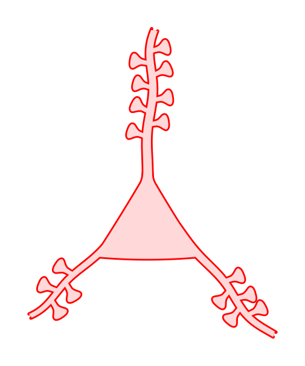
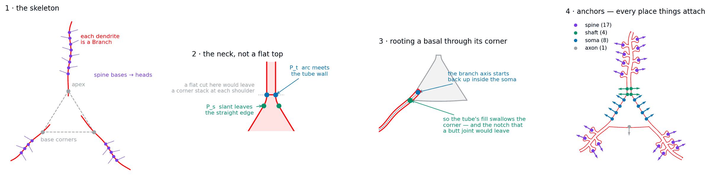
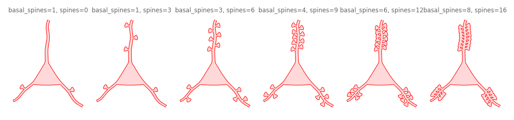
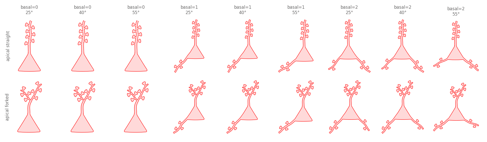
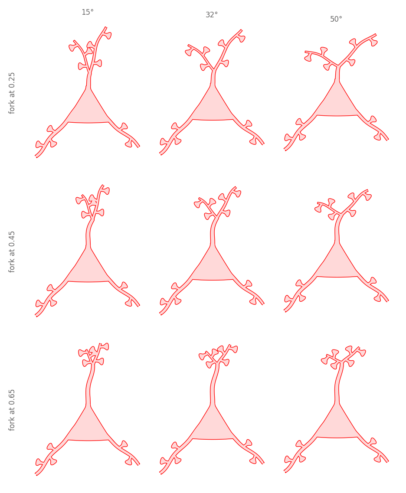

# Pyramidal cell

A triangular soma with spiny dendrites out of it — apical up, basals down —
soma, dendrites and every spine forming **one unbroken outline**.

<p align="center">
  
</p>

## The blueprint



**1 · The skeleton.** The soma is three points; each dendrite is a `Branch`
with its own curve; each spine is a traced `Profile` stamped at a base and
angled toward the tip. Nothing here is special-cased for neurons — swap the
profile and the same skeleton draws a hypha or a root hair.

**2 · The neck, not a flat top.** Cutting the apex flat leaves *two* corner
stacks per shoulder — slanted edge → flat top, then flat top → tube wall — and
a fillet gets clamped to nothing at both. Instead each slanted edge turns
tangentially into the tube wall through an arc: the outline itself curves from
slanted into vertical, and there is no corner left to round.

**3 · Rooting a basal through its corner.** The branch axis runs *through* the
soma corner and starts back up inside the body, so the tube's fill swallows
the corner. Root it anywhere else and the vertex survives beside the branch
with a sliver of a notch between them — and since the slanted edge and the
branch run nearly parallel, that sliver is long and very visible. The flare is
clamped a few degrees wider than the soma edge for the same reason: below
that, the axis leaves through the edge instead of up into the body.

**4 · Anchors.** Every place something can attach, with the direction that
leads away from the cell. Connectors, synapse markers and labels all consume
these, so they work on any shape that exposes them.

## Drawing one

```python
import biodraw as bd

cell = bd.neuro.Pyramidal(
    spines=8,               # spines along the apical
    basal=2,                # basal branches off the soma's bottom corners
    basal_spines=5,         # ...and spines on each of those
    spine_extend=0.04,      # extra neck, so heads stand clear of each other
)

fig, ax = bd.canvas(figsize=(3.0, 4.2))
cell.draw(
    ax=ax,
    wall_lw=1.0,            # wall thickness, in points
    gid="pyramidal",        # names the layers in the exported SVG
)
cell.fit(ax, pad=0.2)
bd.save(fig, "pyramidal.svg")
```

## Spininess



```python
cell = bd.neuro.Pyramidal(spines=9, basal=2, basal_spines=4)
```

## Body plans

How many basals, how wide they splay, and whether the apical forks — the whole
shape space at once:



```python
cell = bd.neuro.Pyramidal(
    spines=7,
    basal=2,                # 0, 1 or 2 legs
    basal_angle_deg=40,     # how wide they splay
    basal_spines=3,
)
```

Past about 60° the legs lie along the soma's bottom edge and flatten the
triangle back into a trapeze — the thing the neck is already fighting.

## Forking the apical



```python
cell = bd.neuro.Pyramidal(
    spines=0,               # bare trunk below the fork
    apical_fork=0.45,       # fraction of the apical reach before it splits
    fork_angle_deg=32,      # how wide the daughters splay
    fork_spines=3,          # spines on each daughter
    basal=2,
    basal_spines=3,
)
```

`trunk_len` stays the cell's full apical reach either way — the daughters
carry what the trunk gives up — so turning the fork on does not silently grow
the cell.

## Making your own sheets

Every grid above is one call, and it is also how you sweep a parameter you are
tuning: build the sheet, look at it, pick the setting.

```python
fig, _ = bd.contact_sheet(
    factory=bd.neuro.Pyramidal,
    variants=[dict(spines=n, basal=2) for n in (0, 3, 6, 9, 12, 16)],
    labels="auto",          # captions from whichever keys differ
    cols=6,
)
bd.save_compact(fig, "sweep.png")
```

Use `row_labels` / `col_labels` instead of `labels` once more than two knobs
vary. A variant inside a shared sheet costs about 0.8 kB; the same variant as
its own image costs around 50 kB, which is why these READMEs show dozens of
cells and few portraits.

## Anchors

Anchors are how anything attaches to a cell. Each is a point, the outward
direction there, and what kind of place it is:

```python
distal   = cell.anchor("spine", branch="apical", rank=-1)  # distal-most spine
flank    = cell.anchor("soma", side=-1, t=0.40)            # left soma wall
shaft    = cell.anchor("shaft", t=0.02)                    # the bare shaft
leaving  = cell.anchor("axon")                             # where the axon goes

dot_position = distal.offset(0.02)      # 0.02 clear of the spine head
```

`nearest` picks the one facing a given source, so a connector lands on the
side it is arriving from rather than reaching around the back:

```python
target = cell.anchors("spine").nearest(point=(-8.0, 1.0))
```

| kind | where | count on the cell above |
|---|---|---|
| `spine` | each spine head, the widest point | 18 |
| `shaft` | the bare proximal apical, both walls | 4 |
| `soma` | down each slanted flank | 4 |
| `axon` | the bottom of the soma, pointing down | 1 |

`shaft` anchors sit *below* the first spine on purpose: a shaft contact
arriving beside a spine head reads as a spine contact, which is a different
claim entirely.

## Files

| | |
|---|---|
| `build.py` | builds every image here — `python tools/build_gallery.py pyramidal` |
| `blueprint.png` | the construction figure |

No SVG is committed here. `bd.save(fig, "cell.svg")` gives you the vector file
whenever you want it, but this cell's runs to 98 kB — more than every raster
in this folder put together, because the hollow render carries two paths per
part. `examples/dendritic_spine/spine.svg` is kept as the standing proof that
vector export works.
