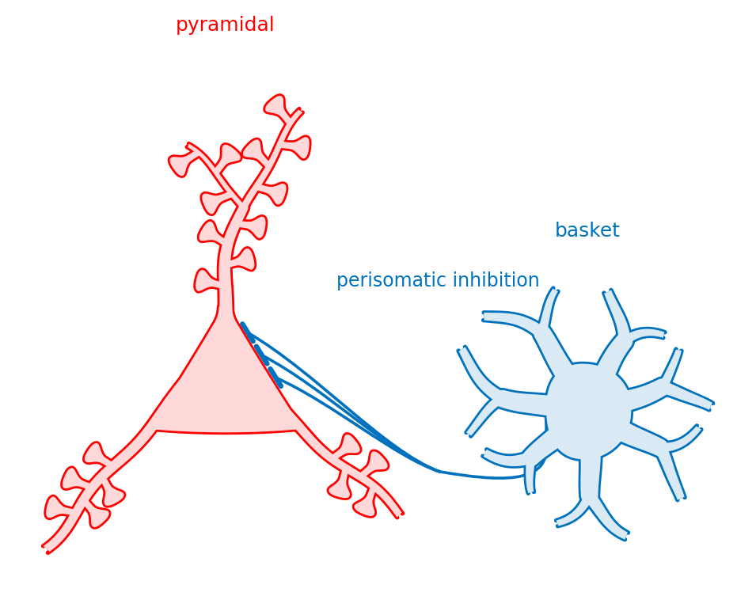
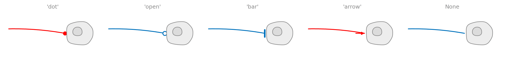
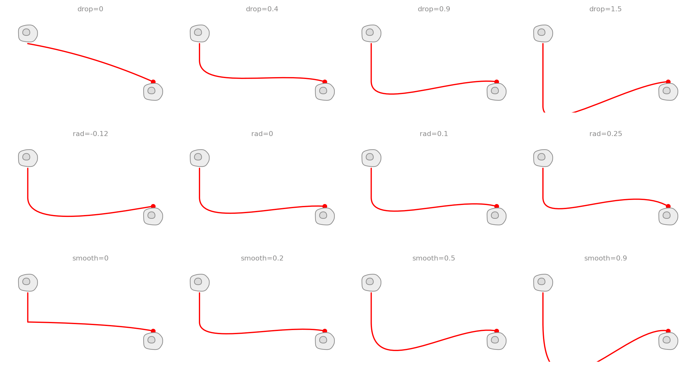
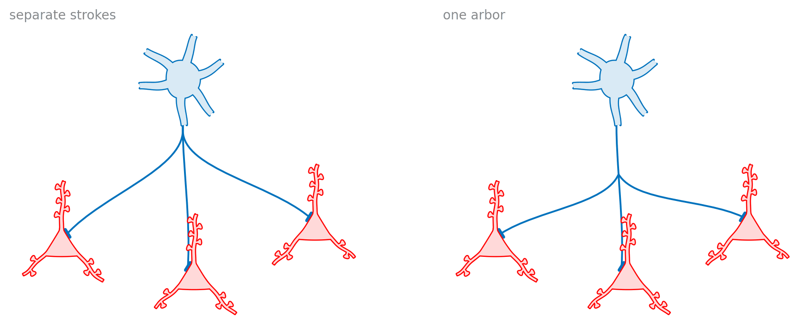

# Axon and wiring

An axon with swellings along it, and everything needed to connect one cell to
another: connectors and the endcaps that say what a connection is.

<p align="center">
  
</p>

Two cell types, an axon with boutons *en passant*, one branching arbor, and
four contacts placed perisomatically — which is what a basket cell does, and
the reason it is drawn as a basket cell.

## The axon

<p align="center">
  
</p>

An axon differs from a dendrite in the one way that matters for a cartoon:
its boutons are **swellings of the process itself**, not things stalked off
it. Drawing them as stalked blobs is the commonest way a cartoon axon ends up
looking like a dendrite.

That falls out of the core for free — `paths.tube` already takes one
half-width per centreline point, which is what gives a dendrite its taper.
Feed it a taper with bumps on it and the same function draws a beaded axon.
No new primitive.

```python
import biodraw as bd

axon = bd.neuro.Axon(
    length=3.2,             # in local units
    boutons=7,              # swellings along the process
    bouton_size=2.1,        # how much fatter it gets at one, x the local width
    collaterals=(0.34, 0.66),   # fractions along it where branches leave
    seed=1,
)

fig, ax = bd.canvas(figsize=(6.0, 2.4))
axon.draw(ax=ax, wall_lw=1.0, gid="axon")
axon.fit(ax, pad=0.12)
```

### Boutons


`bouton_len` is the knob that decides whether a swelling reads as a bouton or
as the axon being wrong — short and fat is a bouton, long and fat is a
mistake. The bumps are Gaussian rather than steps, so the wall swells and
settles instead of stepping; a step shows as two corners on the outline.

### Collaterals


```python
axon = bd.neuro.Axon(
    collaterals=(0.25, 0.5, 0.75),   # where they leave
    collateral_deg=45,               # how far each turns off the parent axis
    collateral_boutons=3,
)
```

Each is sized by Rall against the parent at the branch point, so it is thinner
than what it leaves — a side road off a through-running axon.

### Ends


An **open** end means the process runs off the page; a **terminal** one ends
here, in a final bouton. Those are different claims, so they get different
render treatment: an open end is a stroke whose far end never closes, a
terminal one is a closed shape.

## Wiring

### Endcaps



The mark at the far end is a claim, not decoration:

| | |
|---|---|
| `'dot'` | a synapse, a contact, a junction |
| `'open'` | the same kind of contact, not asserted |
| `'bar'` | inhibition, a block |
| `'arrow'` | flow, direction, causation |
| `None` | the line simply reaches the wall |

Use one meaning per figure and say which in the key.

```python
bd.connect(
    ax=ax,
    source=basket.anchor("soma", deg=270.0),
    target=pyramidal.anchor("soma", nearest=basket.at),
    gap=0.04,               # clearance at the target, in local units
    drop=0.30,              # straight descent before the run begins
    rad=0.05,               # bow; positive always bows *up*
    endcap="bar",           # the claim
)
```

Because both ends are **anchors**, the clearance means the same thing at any
angle and on any shape. That is the whole reason a stand-off never has to be
tuned per contact per figure.

### Connector shape



- **`drop`** — a process does not set off toward its target the moment it
  leaves the cell; it drops clear of the cell's own dendrites first.
- **`rad`** — how far the run bows. Positive bows *up* whichever way the
  connector runs, so a row wired in both directions does not come out with
  half its lines sagging into whatever is below.
- **`smooth`** — how wide the turn out of the descent is. At 0 the join is a
  corner, and a schematic process that turns a hard corner reads as a circuit
  diagram's wire.

### One source, several targets



Drawn as separate strokes, two outputs run side by side for as far as their
targets agree — which reads as two axons — and on a staggered row they cross,
since the lower target's line starts above the higher one's. One process that
leaves and *branches* is both what the cell has and what a drawn arbor looks
like.

```python
bd.connect_tree(
    ax=ax,
    source=basket.anchor("soma", deg=270.0),
    targets=[cell.anchor("soma", nearest=basket.at) for cell in row],
    fork=0.45,              # how far along the shared stem it splits
    spread=0.4,             # how far each branch turns at the fork
    endcap="bar",
)
```

## Where contacts land is yours to say

Deliberately **not** a feature. This library draws the cell and hands you the
places on it; which compartment a contact lands on is a claim about the
circuit, and the author makes it:

```python
targets = [pyr.anchor("soma", side=1, t=t) for t in (0.24, 0.42, 0.60)]
```

An earlier version had an allocator — "eight contacts, five on spines, two on
shaft, one on soma" — and it was removed. Once a cell is drawn, marking it is
a line of matplotlib against anchors that are already public, and a general
drawing library has no business holding one paper's argument about where
synapses go.

What survives is the part that really is drawing: a connector has to *end* in
something, and whether that mark is an arrowhead or a bar is how the figure
says excitation or inhibition.

## Files

| | |
|---|---|
| `build.py` | builds every image here — `python tools/build_gallery.py axon` |
| `circuit.png` | everything composed into one panel |
